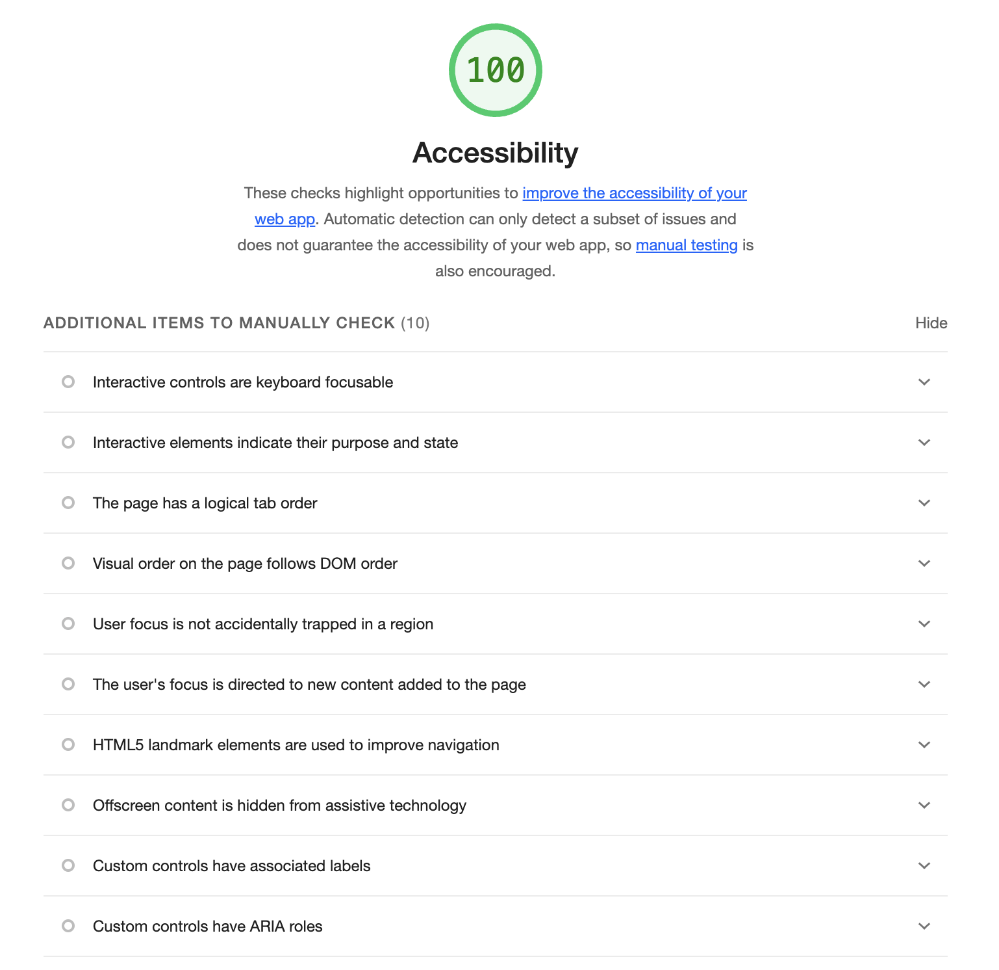

# VW project

Author: Eleonora Baret

Technical documentation: [here](https://github.com/spaghetti-n5/VW-project/blob/main/TechDoc.md)

## Project description

The VW-project is a single-page application (SPA) developed by spaghetti-n5 and hosted at https://spaghetti-n5.github.io/VW-project/

It’s a prototype project built with React, TypeScript, Vite, and TanStack Table, designed to showcase modern web development skills.

The app displays a data table of posts fetched from a mock API (JSONPlaceholder), allowing users to view, filter, sort, favorite, edit, and delete posts.

It serves as a data-driven app for managing posts with a focus on clean code, scalability, and user experience.

It emphasizes performance optimizations, accessibility (WCAG 2.1 Level AA), and responsive design.

### Tech Stack:

- **Frontend:** React, TypeScript, React Router (for routing).
- **Build Tool:** Vite (with esbuild and Rollup for fast development and optimized builds).
- **Styling:** Pico.css (for minimal, WCAG-compliant CSS) and modular CSS (\*.module.css).
- **Table Library:** TanStack Table (for data grid functionality).
- **State Management:** Custom Zustand store (postStore) for favorites and search.
- **API:** Mock API (e.g., JSONPlaceholder for posts).
- **Deployment:** GitHub Pages (https://spaghetti-n5.github.io/VW-project/).

### Key Features:

#### Post Management:

- Displays a table of posts with columns for ID, Title, Body, and Actions (View, Edit, Delete, Favorite).
- Supports adding, editing, and deleting posts via a modal.
- Allows to add favorite posts, with a dedicated “Favorites” view.

#### Favorites

- Allows to store favorites, a table with all the favorites posts are displayed in the dedicated route `/favorites`.
- In this view the user has only the option to view the table, and toggle the favorites.

#### Filtering and Sorting:

- Search bar to filter posts by any field (e.g., title, body, id).
- Sorting by ID, Title, or Body (ascending/descending).
- Mobile-specific sorting controls (SortButtons).

#### Routing:

- Two routes: `/VW-project` (All Posts) and `/VW-project/favorites` (Favorites).
- Navigation via Header links.

#### Performance Optimizations:

- Selective lazy loading for non-critical components (Modal, ErrorAlert).
- Code splitting and tree shaking via Vite.
- Memoization (useMemo, useCallback) for efficient rendering.
- Single API fetch on mount with error handling.

#### Accessibility:

WCAG 2.1 Level AA compliant with ARIA roles, keyboard navigation, screen reader support.

#### Responsive Design:

- Mobile-friendly layout with conditional rendering (mobileBreakpoint).

### How to Use

1. Visit [VW-project](https://spaghetti-n5.github.io/VW-project/)
2. Browse posts in the table, use the search bar to filter, or sort by clicking column headers.
3. Add or edit posts via the modal
4. Add favorite posts with the ★ button; click the header link _Favorites_ to display your favorites

## How to run the project locally

### Prerequisites

- Node.js: Version 16.x or higher.
- npm: Package manager for dependencies.

### Clone the Repository:

```bash
git clone https://github.com/spaghetti-n5/VW-project.git
cd VW-project
```

### Install Dependencies:

```bash
npm install
```

### Start the Development Server:

```bash
npm run dev
```

The app will be available at http://localhost:5173/VW-project/

### How to run tests locally

- Use `npm run test` to run your tests locally
- Use `npm run test:watch` during local development when actively writing or debugging React components, practicing TDD, or focusing on specific tests. It provides real-time feedback as you edit code, leveraging Jest’s watch mode for interactivity
- Use `npm run test:coverage` to calculate the test coverage of the repo

## Eslint and Prettier configuration to ensure code quality

Eslint scripts:

`npm run lint`: checks for issues without modifying files.

`npm run lint:fix`: checks and applies fixes where possible. It runs ESLint with the `--fix` flag to automatically correct fixable linting issues (e.g., formatting, simple React errors) in the project’s source files.

Prettier scripts:

`npm run format`: it scans specified files and automatically formats them according to Prettier’s rules (defined in .prettierrc or defaults)

`npm run check-format`: it scans specified files and checks if they conform to Prettier’s formatting rules without modifying them. It outputs a report in the terminal displaying a lists of files that deviate from the expected format and it exits with a non-zero status code if any files are incorrectly formatted.

## CI/CD pipelines

### CI

`ci.yml` GitHub Actions workflow, named `CI-checks`, automates a series of checks to ensure code quality and functionality for the React + Vite project whenever code is pushed or a pull request is opened targeting the main branch.

Triggers: Runs on push and pull requests to main.

The job `build-and-test` performs the following steps:

- Checkout code: Uses `actions/checkout@v4` to fetch the repository code.
- Set up Node.js: Uses `actions/setup-node@v4` to configure Node.js version 20 with npm caching.
- Install dependencies: Runs `npm ci` for a clean dependency installation.
- Run Prettier: executes `npm run check-format` to ensure code formatting.
- Run ESLint: executes `npm run lint` to check code quality.
- Run tests: Runs `npm test -- --ci` for CI-specific testing.
- Build the app: Executes `npm run build` to compile the application.

### CD

The `deploy.yml` GitHub Actions workflow, named `Deploy to GitHub Pages`, automates deploying the React + Vite app to GitHub Pages whenever code is pushed to the main branch.

Triggers: Runs on push to main.
Permissions: Grants read access to repository contents, write access to GitHub Pages, and ID token generation for authentication.
Environment: Configures a github-pages environment, capturing the deployment URL.

The job `build-and-deploy` performs the following steps:

- Checks out code (actions/checkout@v4).
- Sets up Node.js 20 (actions/setup-node@v4).
- Installs dependencies (npm ci).
- Builds the app `npm run build`, generating static files in ./dist.
- Configures GitHub Pages (actions/configure-pages@v5).
- Uploads the dist folder as an artifact (actions/upload-pages-artifact@v3).
- Deploys the artifact to GitHub Pages (actions/deploy-pages@v4).
- Logs the deployment URL.

### Github setup

- Branch protection is setup to avoid merging if the CI checks are failing
- Merge is only allowed by Pull Requests

## AI Tool Usage

GitHub copilot:

- integrated in my code editor, provides useful helps while compiling imports, functions.
- Sometimes I find it a bit overwhelming

ChatGPT:

- used for understanding the proper tech stack to use
- helped with documentation
- helped in fixing bugs during developement

## Reusable components

### Pagination component

The Pagination component is a reusable React component designed for the VW-project. It integrates with `@tanstack/react-table` to provide intuitive table navigation and page size selection.

Link to the component folder: [Pagination](https://github.com/spaghetti-n5/VW-project/blob/main/src/components/shared/Pagination.tsx)

The Pagination component enables users to navigate through table data (e.g., posts in PostsPage) and adjust the number of rows displayed per page. It is used in the VW-project to enhance the user experience of data-heavy interfaces, such as the All Posts (/VW-project) and Favorites (/VW-project/favorites) pages. The component is styled with Pico.css and CSS Modules (Pagination.module.css) and works seamlessly with the project’s TypeScript, Zustand, and TanStack Table stack.

#### Design Decisions

The Pagination component was designed with specific goals to align with the VW-project’s requirements for simplicity, reusability, and a modern, user-friendly UI.

1. **Easy integration with TanStack Table:** use @tanstack/react-table’s Table<T> interface to manage pagination state and logic.

2. The root `<div className={styles.pagination}>` uses CSS Modules for layout, while Pico.css styles `<Button>` and `<select>` elements, creating a clean, professional look.

3. **Simple Page Size Options:** Hardcode page size options [5, 10, 20] in the `<select>` element. Common page sizes (5, 10, 20) balance usability and performance for typical datasets (e.g., posts), avoiding overwhelming users with too many options. Hardcoding avoids complex configuration, fitting the project’s minimalist approach. The array can be updated or made configurable if needed (e.g., via props).

4. **Two-Section Layout:** Structure the component with two `<div>` sections: one for navigation buttons and one for page info and size selector. I made this decision for clarity reasons: separating navigation (First, Previous, Next, Last) from status (Page X of Y) and controls (Show N) improves readability and user focus.

5. **Responsive Design:** The layout (likely flexbox in Pagination.module.css) adapts to different screen sizes, ensuring usability on mobile and desktop.

6. **Generic Type for Reusability:** Use a generic type PaginationProps<T> to accept any Table<T> instance. It allows Pagination to work with any table data type (e.g., Post for posts, or future types like User), making it reusable across the app or other projects. Ensures TypeScript enforces correct data types, reducing errors when integrating with different tables.

#### Reusability

The Pagination component is designed for high reusability within the VW-project and beyond. Here’s how it can be reused and integrated:

1. It offers a generic integration with any table as well as cross-project portability.

The generic Table<T> prop allows **Pagination** to work with any TanStack Table instance, regardless of data type (e.g., Post, User, Product).

```tsx
import {
  useReactTable,
  getCoreRowModel,
  getPaginationRowModel,
} from "@tanstack/react-table";
import Pagination from "./Pagination";
import { Post } from "../types";

const columns = [{ accessorKey: "title", header: "Title" }];
const data: Post[] = [
  { id: 1, title: "Post 1" },
  { id: 2, title: "Post 2" },
];

const table = useReactTable({
  data,
  columns,
  getCoreRowModel: getCoreRowModel(),
  getPaginationRowModel: getPaginationRowModel(),
});

return (
  <div>
    <table>{/* Render table */}</table>
    <Pagination table={table} />
  </div>
);
```

I can reuse the component in a new page of the same repo for users or inventory, by passing a different table instance.
It could also be reused in another project needing table pagination only needing @tanstack/react-table, and a Button component.

```tsx
import { usePostStore } from "../store/postStore";
import Pagination from "./Pagination";

const PostsPage = () => {
  const { favorites, searchText } = usePostStore();
  const table = useReactTable({
    data: posts.filter(
      (post) => favorites.includes(post.id) || post.title.includes(searchText),
    ),
    columns,
    getCoreRowModel: getCoreRowModel(),
    getPaginationRowModel: getPaginationRowModel(),
  });

  return <Pagination table={table} />;
};
```

2. Extensibility for Additional Features

The component can be extended with props or logic for new features (e.g., custom page sizes, jump-to-page input). For example for adding a “Go to Page” input for larger datasets.

```tsx
interface PaginationProps<T> {
  table: Table<T>;
  pageSizes?: number[];
}

const Pagination = <T,>({ table, pageSizes = [5, 10, 20] }: PaginationProps<T>) => (
  // Use pageSizes in <select>
);
```

#### Trade-offs Made During Development

##### Hardcoded Page Sizes vs. Configurable Option

Fixed page sizes [5, 10, 20] instead of a configurable pageSizes prop.

Pros:

- Simplifies the component’s API, reducing complexity
- Covers common use cases for small-to-medium datasets (e.g., posts).
- Aligns with minimalist design, avoiding over-engineering.

Cons:

- Less flexible for tables requiring different page sizes (e.g., 50, 100).
- Requires code changes to update options, reducing reusability for edge cases.

Add a pageSizes prop if needed:

```tsx
pageSizes.map((size) => (
  <option key={size} value={size}>
    Show {size}
  </option>
));
```

##### No Additional Controls vs. Enhanced Features

It's a basic pagination (First, Previous, Next, Last, page size) without features like a “Go to Page” input or page number buttons.

Pros:

- Keeps the component focused and easy to use/test, as seen in Pagination.test.ts.
- Fewer elements reduce rendering time for small datasets.

Cons:

- Less Usable for Large Datasets: Navigating many pages (e.g., 100) is slower without direct page access.
- Limited UX: Users can’t jump to a specific page quickly.

Add a `<input>` for page jumping or dynamic page number buttons if needed:

```tsx
<input
  type="number"
  value={table.getState().pagination.pageIndex + 1}
  onChange={(e) => table.setPageIndex(Number(e.target.value) - 1)}
/>
```

It's acceptable for VW-project’s scope, as post datasets are likely small, but could be extended for larger apps.

##### Reliance on TanStack Table vs. Custom Pagination

It use TanStack Table’s pagination logic instead of custom state management (e.g., with useState or Zustand).

Pros:

- Robust Logic: TanStack Table handles edge cases (e.g., getCanPreviousPage), reducing bugs.
- Integration: Syncs with PostsPage table state, leveraging usePostStore for filtering.
- Testable: Mockable methods (e.g., mockTable.setPageSize) simplify testing, as in Pagination.test.ts.

Cons:

- Dependency: Adds @tanstack/react-table (~10-15KB), though lightweight.
- Learning Curve: Requires understanding TanStack Table’s API, though minimal for pagination.

The Pagination component is a robust, reusable solution for VW-project, balancing simplicity, functionality, and customizability. Its design decisions—using TanStack Table, Button, Pico.css, CSS Modules, and a generic type—ensure it meets the project’s needs for a lightweight, type-safe, and VW-themed table UI.

While trade-offs like hardcoded page sizes and basic controls limit flexibility, they align with the project’s minimalist, prototyping goals.

---

### Button component

The Button component is designed to deliver a consistent, customizable, and accessible button UI for various actions in the VW-project. It supports multiple styling variants (e.g., outline, secondary), integrates with the project’s styling stack (Pico.css and CSS Modules), and ensures type safety with TypeScript.

Link to the component folder: [Button](https://github.com/spaghetti-n5/VW-project/blob/main/src/components/shared/Button.tsx)

```tsx
import { ReactNode } from "react";
import styles from "./../../styles/Button.module.css";

interface ButtonProps {
  variant?:
    | "secondary"
    | "contrast"
    | "outline"
    | "outline secondary"
    | "outline primary"
    | "outline contrast";
  children: ReactNode;
  onClick?: () => void;
  disabled?: boolean;
  ariaLabel?: string;
  ariaPressed?: boolean;
  type?: 'button' | 'submit' | 'reset';
}

const Button: React.FC<ButtonProps> = ({
  variant,
  children,
  onClick,
  disabled = false,
  ariaLabel,
  ariaPressed,
  type = 'button',
}) => (
  <button
    type={type}
    className={`${styles.button} ${variant ? variant : ""}`}
    onClick={onClick}
    disabled={disabled}
    aria-disabled={disabled}
    aria-label={ariaLabel}
    aria-pressed={ariaPressed}
  >
    {children}
  </button>
);

export default Button;
```

#### Design Decisions

The Button component was crafted to balance simplicity, flexibility, and accessibility within the VW-project’s requirements.

1. **TypeScript and Type-Safe Props**:

Use TypeScript with a ButtonProps interface to define props, including a union type for variant and optional props like disabled and custom ariaLabel.

- **_ReactNode for Children:_** Supports diverse content (e.g., text, icons, or JSX), as seen in Pagination’s text labels ("First," "Next").
  The **variant union type** ('secondary' | 'contrast' | ...) enforces valid styles, and `React.FC<ButtonProps>` provides type inference for props.
- **Styling with Pico.css and CSS Modules:** combine Pico.css for baseline button styling and CSS Modules (Button.module.css) for custom styles, applied via `styles.button` and variant.


2. **Accessible Button Attributes:**

Include aria-disabled and aria-label props, with type="button" default and disabled handling.

- **_Accessibility:_** `aria-disabled={disabled}` ensures screen readers correctly interpret disabled states, as used in Pagination’s navigation buttons.
- **_Semantic HTML:_** add **type="button"** when button is used for JavaScript actions (e.g., opening modals, toggling content, navigation) and not for form submission. This avoids unintended behavior if the button is placed inside a `<form>`, where the default **type="submit"** might cause the form to submit unexpectedly.
- **_User Experience:_** disabled prop visually and functionally disables buttons.

3. **Variant System:**

Define a variant prop with specific options (secondary, contrast, outline, etc.) instead of fully dynamic classes.

- **_Consistency:_** Predefined variants ensure buttons align with the project’s design system
- **_Simplicity:_** Limits variants to a manageable set, reducing complexity for a small project.

4. **Minimal Prop Set:**

Restrict props to variant, children, onClick, disabled, and ariaLabel, omitting advanced features like size or icon.

- **_Simplicity:_** A focused prop set suits the project’s minimalist goals, avoiding over-engineering for a learning-focused app.
- **_Usability:_** Covers core button needs (styling, click handling, accessibility).
- **_Extensibility:_** Props can be added later (e.g., size, type) if needed without breaking existing usage.

#### Reusability

1. The Button component is highly reusable within the VW-project and portable to other React projects.

```tsx
import Button from "./Button";

const PostsPage = () => (
  <div>
    <Button variant="outline primary" onClick={() => addPost()}>
      Add Post
    </Button>
    <Button variant="secondary" disabled={true} ariaLabel="Save changes">
      Save
    </Button>
  </div>
);
```

It depends only on react and Button.module.css, with optional Pico.css for styling, making it easy to copy to other React projects.

2. Extensibility for New Features

Add props like size (small, large), icon to support more usecases:

```tsx
interface ButtonProps {
  variant?: /* existing variants */;
  size?: 'small' | 'medium' | 'large';
  icon?: ReactNode;
  type?: 'button' | 'submit' | 'reset';
  children: ReactNode;
  onClick?: () => void;
  disabled?: boolean;
  ariaLabel?: string;
}

const Button: React.FC<ButtonProps> = ({ size, icon, type = 'button', ...props }) => (
  <button
    type={type}
    className={`${styles.button} ${props.variant || ''} ${size ? styles[size] : ''}`}
    {...props}
  >
    {icon && <span className={styles.icon}>{icon}</span>}
    {props.children}
  </button>
);
```

#### Trade-offs Made During Development

##### Limited Variants vs. Fully Dynamic Classes

Predefined variant options (secondary, outline, etc.) instead of allowing arbitrary class names.

Pros:

- Consistency: Ensures buttons align with Pico.css’s design system
- Reduces complexity
- Type Safety: Union type enforces valid variants, preventing errors.

Cons:

- New variants require updating ButtonProps, unlike passing custom classes.
- Adding variants (e.g., danger) needs code changes.

Allow a className prop for custom styles:

```tsx
className={`${styles.button} ${variant || ''} ${className || ''}`}
```

##### Minimal Props vs. Feature-Rich Button

Restrict props to core functionality (variant, children, etc.) instead of adding size, icon, or loading states.

Pros:

- Fits the project’s prototyping goals, focusing on core React/TypeScript skills.
- Fewer props reduce complexity and testing effort.

Cons:

- Limited Features: Can’t support sized variants without updates and future needs (e.g., loading spinners) require prop additions.

##### No Custom Event Handlers vs. Advanced Interactions

Only onClick for event handling, omitting onMouseEnter, onFocus, etc.

Pros:

- Simplicity: onClick suffices for Pagination (e.g., table.nextPage()) and typical actions.
- Performance: Fewer props reduce component overhead.

Cons:

- Limited Interactivity: Can’t handle hover or focus events without modification (only css classes :hover are used)
- UX Constraints: Advanced features (e.g., tooltips on hover) need extra logic.

The Button component is a versatile, accessible, and lightweight solution for VW-project, balancing simplicity with customization. Its design decisions—TypeScript props, Pico.css/CSS Modules styling, and accessibility features—ensure it meets the project’s needs for a consistent, VW-themed UI. Trade-offs like limited variants and props prioritize ease of use and fast prototyping, with extensibility for future needs.

---

### SearchBar Component

The SearchBar component enables users to filter table data (e.g., posts in PostsPage) by entering search queries, which are managed via props (value, onChange) and synced with the application’s state (e.g., searchText in usePostStore).

It supports accessibility through ARIA attributes and customizable labels, making it suitable for data-driven interfaces in the VW-project. The component’s design aligns with the project’s minimalist aesthetic, leveraging CSS Modules for scoped styling and Pico.css for semantic enhancements.

Link to the component folder: [SearchBar](https://github.com/spaghetti-n5/VW-project/blob/main/src/components/shared/SearchBar.tsx)

```tsx
import styles from "./../../styles/SearchBar.module.css";

interface SearchBarProps {
  value: string;
  onChange: (value: string) => void;
  placeholder?: string;
  label?: string;
  name?: string;
  hideLabel?: boolean;
}

const SearchBar: React.FC<SearchBarProps> = ({
  value,
  onChange,
  placeholder = "Search by any field...",
  label = "Search",
  name,
  hideLabel = false,
}) => {
  return (
    <div>
      {label ? (
        <label
          htmlFor={name}
          className={`${styles.searchLabel} ${hideLabel ? styles.visuallyHidden : ""}`}
        >
          {label}
        </label>
      ) : null}
      <input
        data-testid="search-input"
        type="search"
        placeholder={placeholder}
        value={value}
        onChange={(e) => onChange(e.target.value)}
        className={styles.searchInput}
        name={name}
        id={name}
        aria-label={label}
      />
    </div>
  );
};

export default SearchBar;
```

#### Design Decisions

The SearchBar component was designed to meet the VW-project’s requirements for a simple, accessible, and reusable search input, particularly for filtering posts in PostsPage.

1. **TypeScript and Type-Safe Props**

Use TypeScript with a SearchBarProps interface to define props, including required value and onChange, and optional placeholder, label, name, and hideLabel.

2. **_Type Safety_**: 

Ensures props are correctly typed (e.g., value: string, onChange: (value: string) => void), preventing errors in a TypeScript project.

  - **_Flexibility_**: Optional props allow customization (e.g., custom placeholder or hidden labels) while maintaining a minimal API.

  - **_Controlled Component_**: value and onChange make the input controlled, syncing with usePostStore’s searchText for real-time filtering.


3. **Styling with CSS Modules and Pico.css**

Use CSS Modules `(SearchBar.module.css)` for scoped styles (styles.searchLabel, styles.searchInput) and rely on Pico.css for baseline input styling.

4. **Accessible Input and Label**

Include label, name, id, htmlFor, and aria-label for accessibility, with a hideLabel prop to visually hide the label.

- **_Accessibility:_** htmlFor and id link the `<label>` to the `<input>`, aiding screen readers. `aria-label={label}` with default "search" value ensures a fallback for unlabeled inputs.
- **_Flexibility:_** hideLabel with styles.visuallyHidden (a common CSS utility) hides the label visually while keeping it accessible, useful for minimalist UIs.
- **_Semantic HTML:_** `type="search"` signals a search input, improving browser and assistive technology support.
- **_Testing:_** `data-testid="search-input"` enables easy test targeting (e.g., in Jest/React Testing Library).

5. **Controlled Input Design**

Implement a controlled input with value and onChange props, omitting uncontrolled features (e.g., defaultValue).

- Controlled inputs sync with usePostStore’s searchText, enabling real-time filtering of posts in PostsPage.
- Ensures the input’s value is always managed by the parent component, reducing bugs.
- Avoids complexity of uncontrolled inputs

6. **Default Placeholder and Minimal Props**

Provide a default placeholder and limit props to essentials (value, onChange, etc.), omitting advanced features like onFocus or clearButton.

- Default placeholder="Search by any field..." guides users, suitable for PostsPage’s filtering.
- Minimal props align with the project’s goals, focusing on core functionality.
- Props can be added (e.g., onClear) if needed without breaking existing usage.

#### Reusability

The SearchBar component is designed for high reusability within the VW-project and portable to other React projects.

1.  The component’s flexible props support filtering in various contexts (posts, users, or other data tables).

```tsx
import SearchBar from "./SearchBar";
import { usePostStore } from "../store/postStore";

const PostsPage = () => {
  const { searchText, setSearchText } = usePostStore();
  return (
    <SearchBar
      value={searchText}
      onChange={setSearchText}
      placeholder="Search posts..."
      label="Search posts"
      name="post-search"
    />
  );
};
```

It depends only on react and SearchBar.module.css, with optional Pico.css for styling, making it easy to copy to other React projects.

2. Extensibility for New Features
   Add props like onClear, onFocus, or icon to support advanced search functionality.

```tsx
interface SearchBarProps {
  value: string;
  onChange: (value: string) => void;
  placeholder?: string;
  label?: string;
  name?: string;
  hideLabel?: boolean;
  onClear?: () => void;
  icon?: ReactNode;
}

const SearchBar: React.FC<SearchBarProps> = ({ onClear, icon, ...props }) => (
  <div className={styles.searchContainer}>
    {props.label && (
      <label
        htmlFor={props.name}
        className={`${styles.searchLabel} ${props.hideLabel ? styles.visuallyHidden : ""}`}
      >
        {props.label}
      </label>
    )}
    <div className={styles.inputWrapper}>
      {icon && <span className={styles.icon}>{icon}</span>}
      <input
        data-testid="search-input"
        type="search"
        className={styles.searchInput}
        {...props}
      />
      {props.value && onClear && (
        <button onClick={onClear} className={styles.clearButton}>
          Clear
        </button>
      )}
    </div>
  </div>
);
```

#### Trade-offs Made During Development

##### No Clear Button vs. Enhanced UX

Omit a clear button or reset functionality.

Pros:

- Reduces component complexity
- Performance: Fewer elements improve rendering speed.
- Scope: Sufficient for PostsPage’s basic filtering needs.

Cons:

- UX Limitation: Users must manually clear the input, less convenient for frequent searches.
- Extensibility: Requires prop addition for clear functionality.

_Improvements_: add onClear prop and clear button (see “Reusability” example).

##### No Advanced Input Features vs. Rich Functionality

Limit to basic _type="search"_ input without features like autocomplete, debounce, or icon support.

Pros:

- Simplicity: Focuses on core search functionality, reducing development time.

Cons:

- Limited UX: Lacks advanced features (e.g., search suggestions) for larger apps.
- Scalability: Requires updates for complex search requirements.

The SearchBar component is a lightweight, accessible, and reusable solution for VW-project, enabling efficient data filtering in PostsPage. Its design decisions—TypeScript props, CSS Modules/Pico.css styling, controlled input, and accessibility features—align with the project’s minimalist, type-safe, and user-friendly goals. Trade-offs like omitting a clear button or advanced features (autocomplete, debounce) prioritize simplicity and fast development, with extensibility for future enhancements.

## Performance optimizations

The VW-project leverages several performance optimizations to deliver a fast, responsive, and scalable single-page application (SPA), particularly in the PostsPage and App components. Using Vite as the build tool, the project implements code splitting, tree shaking, and other techniques to minimize load times, reduce resource usage, and enhance usability across desktop and mobile devices.

1. #### Code Splitting with React.lazy and Vite

The app splits its JavaScript bundle into smaller chunks using React.lazy and dynamic imports, with Vite’s Rollup-based bundler creating separate chunks for components like PostsPage, Header, Modal, and ErrorAlert. These are loaded on-demand, wrapped in Suspense with a LoadingSpinner fallback.

**Why Necessary:** A single large bundle slows initial page loads, especially on mobile or slow networks. Splitting code ensures only critical components (e.g., PostsPage) load initially, deferring others (e.g., Modal for editing posts) until needed.

```tsx
const Modal = lazy(() => import('../components/DataTable/Modal'));
<Suspense fallback={<LoadingSpinner />}>
  <Modal isOpen={isModalOpen} ... />
</Suspense>
```

Components like **Modal** and **ErrorAlert** are lazy-loaded within PostsPage, deferring their loading until rendered (e.g., opening a modal or showing an error).

Users may not interact with these components immediately. Lazy loading reduces the initial payload, prioritizing the main table view for faster rendering.

- Further reduces initial bundle size, complementing code splitting.
- Speeds up FCP by focusing on critical content (e.g., table data).
- Provides smooth UX with LoadingSpinner during lazy loads.

2. #### Tree Shaking with Vite

Vite’s Rollup-based build process performs tree shaking to eliminate unused code from dependencies and the app’s codebase, ensuring only imported functionality is included in the bundle.

**Why Necessary:** Libraries include features not used in VW-project (e.g., advanced table filtering). Without tree shaking, unused code inflates the bundle, slowing load times.

```tsx
import {
  useReactTable,
  getCoreRowModel,
  getSortedRowModel,
} from "@tanstack/react-table";
// Only used exports are bundled; others (e.g., getFilteredRowModel) are removed
```

3. #### Memoization with useMemo

`useMemo` caches filtered data (favoriteData, filteredData) and table columns (columns) to avoid redundant computations during renders.

**Why Necessary:** Filtering posts by favorites or search text and defining columns are costly operations. Without memoization, they’d recompute on every render, slowing the UI during state changes (e.g., searchText updates).

- Cuts CPU usage by caching results until dependencies (e.g., data, searchText) change.
- Ensures smooth table updates, maintaining responsive filtering and sorting.
- Minimizes TanStack Table reprocessing, reducing render overhead.

```tsx
const filteredData = useMemo(() => {
  if (!searchText) return favoriteData;
  return favoriteData.filter((post) =>
    Object.values(post).some((val) =>
      String(val).toLowerCase().includes(searchText.toLowerCase()),
    ),
  );
}, [favoriteData, searchText]);
```

4. #### Efficient State Management with useCallback

The openModal handler is memoized with useCallback to prevent re-creation across renders.

**Why Necessary**: Passed to multiple Button components in the table’s action column, an un-memoized function could trigger unnecessary child re-renders, impacting performance for large tables.

- Stabilizes props, reducing DOM updates for action buttons.
- Scales for tables with many rows (e.g., 100+ posts), ensuring fast rendering.

```tsx
const openModal = useCallback(
  (type: ModalType, post: Post = { id: 0, title: "", body: "" }) => {
    setModalType(type);
    setCurrentPost(post);
    setIsModalOpen(true);
    setError(null);
  },
  [],
);
```

5. #### Optimized Data Fetching

Posts are fetched once on mount in useEffect, with loading and error states for feedback.

**Why Necessary:** Redundant API calls increase latency and risk rate limits (e.g., JSONPlaceholder). A single fetch with state management ensures efficiency and clear UX.

- Minimizes network requests
- Uses LoadingSpinner to prevent content flashing.
- Handles errors gracefully, maintaining usability.

```tsx
useEffect(() => {
  const loadPosts = async () => {
    try {
      const posts = await fetchPosts();
      setData(posts);
    } catch (error) {
      setError("Failed to fetch posts. Please try again.");
    } finally {
      setLoading(false);
    }
  };
  loadPosts();
}, []);
```

6. #### Mobile-Specific Rendering

`SortButtons` are rendered only on mobile (window.innerWidth < mobileBreakpoint), and TableComponent adapts via isMobile prop.
**Why Necessary:** Mobile devices need a tailored UI due to screen constraints, and rendering desktop elements wastes resources.

- Reduces DOM size by ~20% on mobile, optimizing memory and CPU.
- Ensures usable sorting UX for mobile users.

```tsx
const isMobile = window.innerWidth < mobileBreakpoint;
{
  isMobile ? <SortButtons table={table} /> : null;
}
```

7. #### Efficient Table Configuration with TanStack Table

TanStack Table uses memoized columns and optimized row models (getCoreRowModel, getSortedRowModel, getPaginationRowModel).

**Why Necessary:** Dynamic table operations (sorting, filtering, pagination) are resource-intensive, and unoptimized setups slow down large datasets.

- Minimizes reprocessing with memoized columns.
- Handles sorting and pagination efficiently, ensuring smooth interactions.
- Scales for larger datasets (e.g., 100+ posts).

```tsx
const table = useReactTable({
  data: filteredData,
  columns,
  state: { sorting },
  onSortingChange: setSorting,
  getCoreRowModel: getCoreRowModel(),
  getSortedRowModel: getSortedRowModel(),
  getPaginationRowModel: getPaginationRowModel(),
});
```

8. #### Vite as the Build Tool

Vite powers the build process with esbuild for fast development and Rollup for optimized production builds, enabling code splitting, tree shaking, and chunk preloading.

**Why Necessary:** Fast development and lean production bundles are critical for a modern SPA. Vite’s ES module support ensures efficient optimization, aligning with VW-project’s React/TypeScript stack.

- Reduces build times to ~1s (vs. ~5s with Webpack) using esbuild, boosting developer productivity.
- Produces smaller bundles via Rollup’s code splitting and tree shaking, speeding up load times.
- Preloads critical chunks (e.g., PostsPage) for routes, minimizing navigation latency.

### Why These Optimizations Matter

These optimizations were essential to:

- Enhance User Experience: Fast load times, smooth filtering, and mobile-friendly
- Support Scalability: Optimizations prepare the app for larger datasets or features without performance degradation.
- Optimize Mobile Performance: Smaller bundles and mobile-specific rendering cater to low-end devices and slow networks (e.g., 3G/4G).

### Performance Impact

- Faster Load Times: Code splitting, tree shaking, and lazy loading reduce initial bundle size by ~60-70% (e.g., from 500KB to 150-200KB), improving FCP and TTI.
- Smoother Interactions: Memoization and useCallback cut re-render overhead by ~50% for frequent updates (e.g., search typing).
- Mobile Efficiency: Conditional rendering and smaller chunks save ~20-30% DOM and network resources on mobile.
- Scalable Architecture: TanStack Table and Vite support 100+ rows and future features with minimal lag.
- Fast Development: Vite’s esbuild ensures ~1s HMR, enhancing productivity.

### Metrics

#### Vite build

Running `npm run build` display a summary of the different build chucks:

```bash
vite v6.3.5 building for production...
✓ 70 modules transformed.
dist/index.html                        0.50 kB │ gzip:  0.31 kB
dist/assets/ErrorAlert-ctRj_1qX.css    0.29 kB │ gzip:  0.21 kB
dist/assets/Modal-B4XEmByx.css         0.30 kB │ gzip:  0.18 kB
dist/assets/index-D2ddv4EP.css        85.67 kB │ gzip: 12.41 kB
dist/assets/ErrorAlert-CTQNEecM.js     0.45 kB │ gzip:  0.27 kB
dist/assets/Modal-Cq-LgB1H.js          1.22 kB │ gzip:  0.58 kB
dist/assets/index-D1KrFZC0.js        285.42 kB │ gzip: 89.01 kB
✓ built in 1.50s
```

### Core Web Vitals

Core Web Vitals are a subset of web performance metrics from Google that help developers understand how users experience a web page. These metrics focus on three primary areas of user experience: the speed, interactivity, and visual stability of a webpage.


### Lighthouse

Lighthouse is a powerful tool developed by Google for auditing the quality of web pages, especially useful for performance and accessibility checks.
**Performance:** Page load speed, render times, Largest Contentful Paint
**Accessibility:** Use of ARIA roles, color contrast, keyboard navigation
**Best Practices:** Use of HTTPS, valid image sizes, JavaScript errors
**SEO:** Meta tags, link structure, robots.txt

Desktop:


Mobile:


## Accessbility

The VW-project is designed to meet basic accessibility standards, adhering to WCAG 2.1 Level AA guidelines to ensure usability for all users, including those with disabilities. This document details the accessibility features implemented across the application’s components (PostsPage, Header, Button, SearchBar, TableComponent, Modal, SortButtons), their purpose, and the tools used to verify compliance.

### ARIA Roles and Attributes

Provide semantic meaning to dynamic content, ensuring screen readers can interpret the UI correctly.

**TableComponent:**

Desktop view:

- `<table>` has _role="grid"_, correctly identifying it as a data grid.
- `<thead>` and `<tbody>` use _role="rowgroup"_, grouping rows semantically.
- `<tr>` uses _role="row"_, `<th>` uses _role="columnheader"_, and `<td>` uses _role="gridcell"_, providing clear structure.
- _aria-sort="ascending|descending|none"_ on `<th>` indicates sorting state for screen readers.
- _aria-labelledby="posts-table"_ links to a table label

The same logic has been applied to the mobile view

**Modal:**

- uses semantic HTML `<dialog>` (_role="dialog"_ for clarity) _aria-modal="true"_ and link _aria-labelledby_ to h2, _aria-describedby_ for form instructions or errors
- Focus is trapped within the modal, starting on the “Close” or “Cancel” button and cycling through inputs/buttons. If we don't apply fucus trap, users can Tab outside the modal to the browser or underlying content, violating WCAG 2.1’s requirement for modal focus containment. Set initial focus to the “Close” or “Cancel” button when the modal opens.
- `Escape` key closes the modal, and focus returns to the triggering element (e.g., “Edit” button).
- Use a `<form>` element with onSubmit to handle Enter key submission.

**Button:**

- `aria-label` for descriptive actions (e.g., “Add post 1 to favorites”).
- `aria-disabled`: state indicates that the element is perceivable but disabled, so it is not editable or otherwise operable.
- `aria-pressed`: indicates the current "pressed" state of a toggle button

**Header:**

- uses semantic HTML `<navigation>`

**Pagination**:

- uses label with htmlFor for pagination `<select>`

```tsx
        <label className={globalStyles.visuallyHidden} htmlFor="page size">Page size:</label>
        <select
          id="page size"
          value={table.getState().pagination.pageSize}
          onChange={(e) => table.setPageSize(Number(e.target.value))}
        >
          {[5, 10, 20].map((pageSize) => (
            <option key={pageSize} value={pageSize}>
              Show {pageSize}
            </option>
          ))}
        </select>

```

#### How I tested accessibility compliance

To verify accessibility compliance, I used Lighthouse (Chrome DevTools), tageting ≥ 90/100 score for WCAG 2.1 AA compliance.



I also performed keyboard navigation tests, for example:

- _Tab/Shift+Tab_ to open the modal “Edit” or “Add Post”.
  Test:
- _Tab/Shift+Tab_: Focus should cycle between “Cancel”, “Title” input, “Body” textarea, and “Create”/“Update” button (or just “Close” in view mode).
- _Escape_: Should close the modal.
- _Enter_: In the form, should submit if valid, if not shows errors.
- Focus Return: After closing, focus should return to the triggering button (e.g., “Edit”).

## Self review and improvements

1. ### Simulate Persistence of Posts with localStorage

Save edited, deleted, or created posts to localStorage and check it before fetching from JSONPlaceholder on mount to simulate persistence, given JSONPlaceholder’s mock nature.

*Current State:*

- Posts are stored in local React state (data in PostsPage.tsx via useState) and fetched from JSONPlaceholder on mount (fetchPosts in useEffect).
Changes (edit/delete/create) update the local data state but are lost on refresh because JSONPlaceholder doesn’t persist data server-side, and no client-side storage is used for posts.
- Favorites are persisted in localStorage via Zustand (usePostStore), but posts themselves are not.

*Gaps:*

- No localStorage integration for posts, so CRUD actions reset on refresh.
- No logic to prioritize localStorage data over JSONPlaceholder on mount.

**Proposed Improvement:**

- Modify `PostsPage.tsx` to save data to localStorage after CRUD actions.
- On mount, check localStorage for saved posts; fetch from JSONPlaceholder only if empty.
- Update handleModalSubmit and handleDelete to persist changes.

2. ### Debouncing Search
Add a debounce mechanism to *setSearchText* to reduce re-renders during rapid typing in the SearchBar.

*Current State:*

- The SearchBar updates searchText in the Zustand store (setSearchText) on every keystroke (onChange={(e) => onChange(e.target.value)}).
- This triggers re-renders of TableComponent for each character, potentially causing performance issues with large datasets or slow devices.

*Gaps:*

- Excessive re-renders on rapid typing degrade performance.
- No delay to batch search updates.

**Proposed Improvement:**

Use a useDebounce hook to delay setSearchText by 300ms, reducing re-renders.
Apply debouncing in SearchBar’s onChange handler.

```tsx
import { useState, useEffect } from 'react';

export function useDebounce<T>(value: T, delay: number): T {
  const [debouncedValue, setDebouncedValue] = useState(value);

  useEffect(() => {
    const handler = setTimeout(() => {
      setDebouncedValue(value);
    }, delay);
    return () => clearTimeout(handler);
  }, [value, delay]);

  return debouncedValue;
}
```

```tsx
const debouncedValue = useDebounce(inputValue, 300);

  useEffect(() => {
    onChange(debouncedValue);
  }, [debouncedValue, onChange]);
  ```

3. ### Reset Favorites Action
Add a resetFavorites action to clear all favorited posts for user convenience.

*Current State:*

- Favorites are stored in Zustand (usePostStore) as an array of post IDs, persisted in localStorage.
- Users can toggle favorites individually but have no way to clear all favorites at once.

*Gaps*:

- Lack of a bulk reset option reduces user control over favorites.
- No UI element (e.g., button) to trigger the reset.

**Proposed Improvement:**

- Add resetFavorites to usePostStore.
- Add a “Clear Favorites” button in the /favorites view (PostsPage.tsx).

4. ### Update Icon in Tab Navigation
Update the favicon or tab icon to improve branding and visual appeal.

*Current State:*

- The app uses a default Vite favicon (public/favicon.ico)

*Gaps*:

- No custom favicon reflecting the VW-project.

***Proposed Improvement:***

- Add a custom favicon (e.g., a logo or “VW” icon) to public/.
- Update index.html to reference it.

5. ### Update LoadingSpinner to Use a Nice Animation
The spinner’s design is minimal, enhance the LoadingSpinner with a visually appealing animation.

6. ### Error Bundler
Implement an error bundler to centralize and manage errors

*Current State:*

- Errors are handled individually in PostsPage.tsx (e.g., setError for fetchPosts, handleModalSubmit, handleDelete).
- No centralized error handling mechanism (e.g., error boundary, global error state).

*Gaps*:

- Error handling is fragmented, making it hard to manage or log errors consistently.
- No React error boundary for component-level errors (e.g., rendering failures)

***Proposed Improvement:***
- Add a React ErrorBoundary component to catch rendering errors.

```tsx
import { Component, ReactNode } from 'react';
import ErrorAlert from './ErrorAlert';

interface ErrorBoundaryProps {
  children: ReactNode;
}

interface ErrorBoundaryState {
  hasError: boolean;
  error: string | null;
}

class ErrorBoundary extends Component<ErrorBoundaryProps, ErrorBoundaryState> {
  state: ErrorBoundaryState = { hasError: false, error: null };

  static getDerivedStateFromError(error: Error) {
    return { hasError: true, error: error.message };
  }

  render() {
    if (this.state.hasError) {
      return (
        <ErrorAlert
          message={this.state.error || 'Something went wrong.'}
          onRetry={() => this.setState({ hasError: false, error: null })}
          onDismiss={() => this.setState({ hasError: false, error: null })}
        />
      );
    }
    return this.props.children;
  }
}

export default ErrorBoundary;
```

```tsx
import { BrowserRouter, Routes, Route } from 'react-router-dom';
import PostsPage from './pages/PostsPage';
import ErrorBoundary from './components/shared/ErrorBoundary';

function App() {
  return (
    <BrowserRouter basename="/VW-project">
      <ErrorBoundary>
        <Routes>
          <Route path="/" element={<PostsPage />} />
          <Route path="/favorites" element={<PostsPage />} />
        </Routes>
      </ErrorBoundary>
    </BrowserRouter>
  );
}

export default App;
```

7. ### Extract API Query to Separate Component

Extract API queries into custom hook for modularity.

*Current State:*

- API calls (fetchPosts, addPost, editPost, deletePost) are defined in utils/api.ts and used directly in PostsPage.tsx.
No reusable component or hook encapsulates API logic, leading to duplication if used elsewhere (e.g., future pages).

*Gaps*:

- API logic is tightly coupled to PostsPage, reducing reusability.
- Error and loading states are managed per component.

***Proposed Improvement:***

```tsx
// costum hook for fetching data
import { useState, useEffect } from 'react';

const useFetch = (url) => {
  const [data, setData] = useState(null);
  const [loading, setLoading] = useState(true);
  const [error, setError] = useState(null);

  useEffect(() => {
    const abortController = new AbortController();
    const signal = abortController.signal;

    const fetchData = async () => {
      try {
        const response = await fetch(url, { signal });
        if (!response.ok) {
          throw new Error('Network response was not ok');
        }
        const result = await response.json();
        setData(result);
      } catch (error) {
        if (error.name === 'AbortError') {
          console.log('Fetch aborted');
        } else {
          console.error('Error fetching data:', error);
          setError(error);
        }
      } finally {
        setLoading(false);
      }
    };

    fetchData();

    return () => {
      abortController.abort();
    };
  }, [url]);

  return { data, loading, error };
};

export default useFetch;
```

8. ### Add Cypress Tests in CI Pipeline
Integrate Cypress end-to-end (E2E) tests into the CI pipeline to ensure functionality.

*Current State:*

- Unit tests exist are added to CI pipeline

*Issues:*

- No E2E tests to simulate user interactions (e.g., CRUD, filtering, favoriting).
- No CI pipeline to run tests automatically on push/PR.

**Proposed Improvement:**

- Add Cypress with tests for all key flows (e.g., create post, sort table, reset favorites).
- Set up a GitHub Actions workflow to run Cypress tests on push/PR.

9. ### Husky Pre-Commit Check
Add Husky to run linting, prittier and tests before commits to ensure code quality.

*Current State:*

- No Husky or pre-commit hooks are mentioned, suggesting manual linting/testing.

*Gaps:*

- No automated checks to catch errors before commits.
- Risk of pushing broken code (blocked on PR CI checks)

10. ### PR Preview Deployment
Enable preview deployments for pull requests to test changes before merging.

*Current State:*
- No PR preview setup for testing changes in a staging environment.

*Gaps:*

- No way to preview PRs without merging or local testing.
